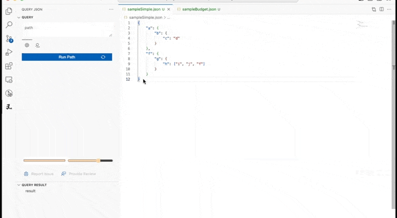
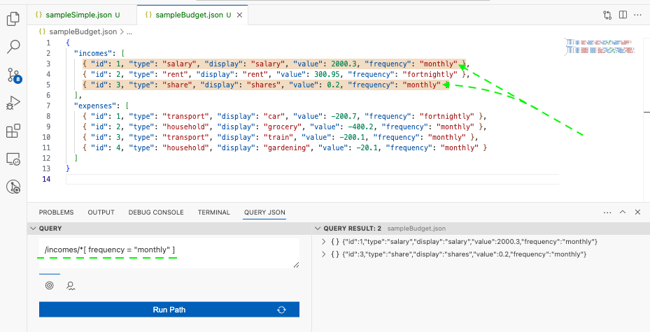
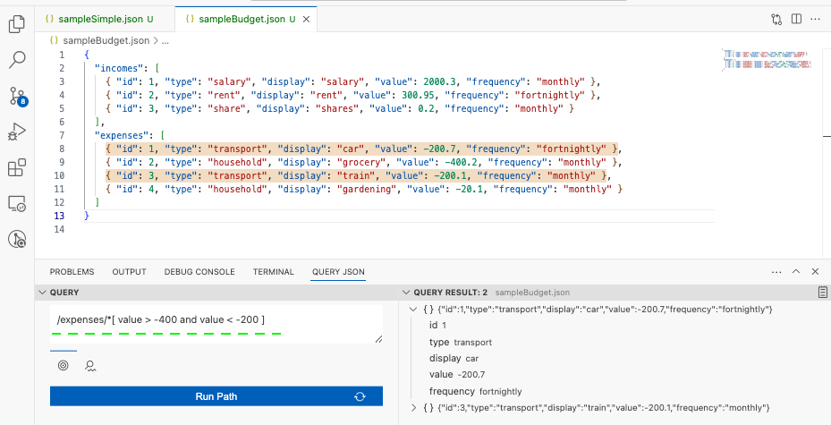

# Query JSON - lite

Interactively query a JSON file using XPath like notation

## Features
- [Query JSON object | array](#query-json-object--array)
- [Filtering](#filtering)
- [Built in Functions](#built-in-functions)
- [Find Mode (beta)](#find-mode-beta-release)
- [Editor Features](#editor-features)

### Query JSON object | array
#### object
- "/a/b" : *get the value of "b" by traversing from root to "a" to "b"*
- "//h" : *from root grab any decendants' value with key "h"*
#### array

- /incomes/\* : *grab all objects in incomes array*
- /incomes/\*/type : *return all income types*

---

### Filtering
- /incomes/\*[ frequency = "monthly" ]: *return incomes that have a frequency value of "monthly"*

- /expenses/\*[ value > -400 and value < -200 ]: *return expenses where its' value is between -400 and -200*

---

### Built in Functions

Query JSON uses JSXPath behind the scene to perform path querying. Check out the available built-in [functions here](https://github.com/Quang-Nhan/JSXPath/blob/master/README.md#built-in-functions).

- **count**( /expenses/*[ type = "transport"] ): *Count how many transport expenses.*

- **ceiling**( /incomes/\*[ **last**() ]/value ): *combines both ceiling and last functions to return the rounded up integer value of the last positioned income*

- **sum**( /incomes/\*[frequency="monthly"]/value ) - **abs**( **sum**( /expenses/\*[frequency="monthly"]/value ) ): *combines both sum and abs functions to get the net income for incomes and expenses that have frequency of "monthly"*

---

### Find Mode (*beta release)
Search through workspace folders for the given path expression
- return files that matches the search term and the entered path expression
- search term examples
    - > search term: *file.json* - search for all directories for file.json
    - > search term: *\*file\*.json* - search for all directory for files that contains "file" in their name
    - > search term: *dir* - search for directories or json files that contains "dir" in their name 
- search term is case insensitive
- supports multi search terms separate by commas
    - > search term: *file1.json,file2.json* - search for all directories for file1.json and file2.json files

---
### Editor Features

- **Result to new file**: once the result is returned in the Query Result view, view the whole result in a new file by clicking on the Output button displayed next to the Query Result title.
- **Path History**: each run will save the path (max 20) to be reused and important ones can be starred (max 5)
- **Dynamic Highlight**: highlight the result in the queried document with selectable/adjustable color
- **Jump to line**: click on any child of the Query Result to jump to the matching text in the editor
