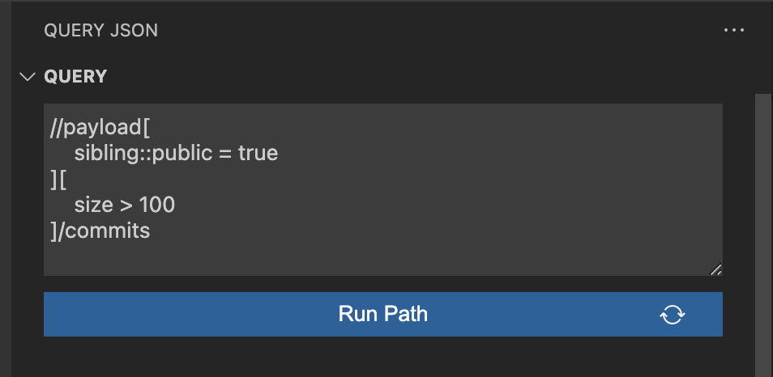
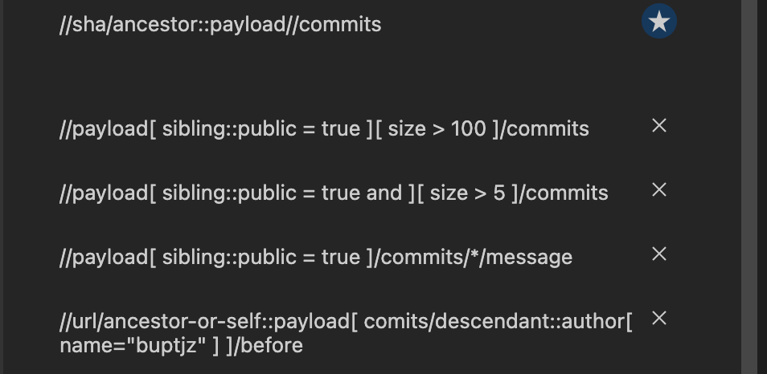

# Query JSON - lite

Interactively query a JSON file using XPath like notation

## Features
- [Query JSON object](#query-json-object)
- [Query JSON array](#query-json-array)
- [Filtering](#filtering)
- [Built in Functions](#built-in-functions)
- [Jump to line](#jump-to-line-v010)
- [Result to new file](#result-to-new-file)
- [Latest features in v0.2.0](#latest-feature-v020)

### Query JSON object
- "/a/b" : *get the value of "b" by traversing from root to "a" to "b"*
- "//h" : *from root grab any decendants' value with key "h"*

---
### Query JSON array
- /incomes/\* : *grab all objects in incomes array*
- /incomes/\*/type : *return all income types*

---
### Filtering
- /incomes/\*[frequency = "monthly"]: *return incomes that have a frequency value of "monthly"*

- /expenses/\*[value > -400 and value < -200 ]: *return expenses where its' value is between -400 and -200*

---
### Built in Functions

Query JSON uses JSXPath behind the scene to perform path querying. Check out the available built-in [functions here](https://github.com/Quang-Nhan/JSXPath/blob/master/README.md#built-in-functions).

- **count**( /expenses/*[ type = "transport"] ): *Count how many transport expenses.*

- **ceiling**( /incomes/\*[ **last**() ]/value ): *combines both ceiling and last functions to return the rounded up integer value of the last positioned income*

- **sum**( /incomes/\*[frequency="monthly"]/value ) - **abs**( **sum**( /expenses/\*[frequency="monthly"]/value ) ): *combines both sum and abs functions to get the net income for incomes and expenses that have frequency of "monthly"*

---
### Jump to line
This feature makes use of vscode symbols to quickly jump to the line of the file that is related to the returned query result

> Note:  
> For large JSON files, this feature may not seem to work as there is a soft limit imposed by vscode for performance purposes.  
> You can override the default max value by going into Settings and change the value of `json.maxItemsComputed` (`JSON: Max Items Computed`). Reopen the queried file and perform `Run Path` again.
 
---
### Result to new file
Once the result is returned in the Query Result view, it can also be viewed in the editor by clicking on the Output button displayed next to the Query Result title.

---
### Latest Feature (v0.2.0)
1. Changed input path from input text to a textarea field
    - allows newline within paths
    - this should improve readability for long paths

    

2. Added path history list (up to 20 paths)
    - remembers previously used paths to quickly reuse them
    - ability to delete unused paths

    